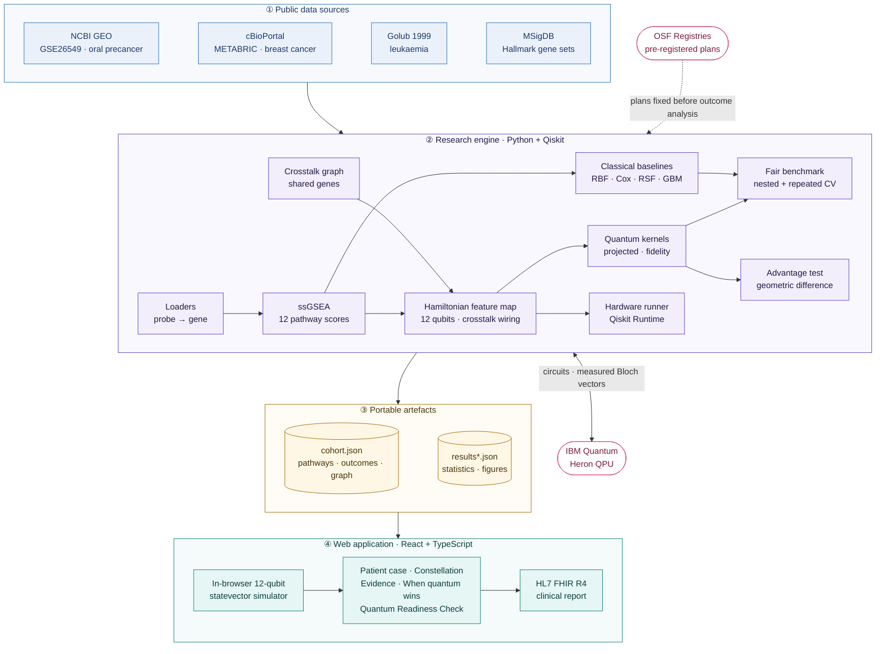
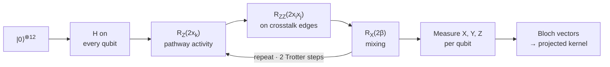

<div align="center">

# SANKET

### Hybrid quantum machine learning for early cancer detection, with an honest test of when quantum actually helps

[](https://sih.gov.in)
[](#overview)
[](https://www.ibm.com/quantum/qiskit)
[](https://www.python.org)
[](https://react.dev)
[](https://www.typescriptlang.org)
[](https://osf.io)
[](#limitations-and-intended-use)

**Team Yukthi6G** · BVRIT Hyderabad College of Engineering for Women

[Overview](#overview) ·
[Key results](#key-results) ·
[Architecture](#system-architecture) ·
[Quick start](#quick-start) ·
[Reproducing the study](#reproducing-the-study) ·
[Web app](#the-web-application) ·
[Limitations](#limitations-and-intended-use)

</div>

---

## Overview

About one in five oral precancers (leukoplakia) turns into cancer, and under the microscope the lesions that will progress look the same as those that will not. SANKET reads the gene activity in a biopsy, encodes it into a quantum circuit **wired like the biology itself**, and estimates whether and when a lesion will become cancer.

Most quantum machine learning projects report high accuracy on easy benchmarks and stop there. SANKET is built around a harder question: **does the quantum part actually help, and how would we know?** Every quantum model is compared against classical models with the same tuning budget, analysis plans are registered publicly before outcomes are examined, and a geometric-difference test checks in advance whether quantum has any room to help on a given dataset.

| | |
|---|---|
| **Problem statement** | SIH26139 — Hybrid Quantum Machine Learning Platform for Early Disease Detection (Egreen Quanta) |
| **Flagship task** | Time to oral cancer in patients with oral premalignant lesions |
| **Encoding** | 12 Hallmark pathways → 12 qubits, entangled along pathway crosstalk |
| **Real patients analysed** | 2,133 across three cancers (oral, breast, leukaemia) |
| **Verification** | Browser and batched simulators match Qiskit `Statevector` to 10⁻¹⁵ |

---

## Key results

All numbers below come from real patient data. Survival analyses use Harrell's concordance index (C-index); diagnosis tasks use ROC AUC. Quantum and classical models receive identical tuning budgets, chosen inside cross-validation.

### Quantum versus classical on real outcomes

| Task | Data | Patients | Projected quantum kernel | Classical RBF kernel | Best classical model | Verdict |
|---|---|---:|---:|---:|---|---|
| Oral cancer progression | GEO GSE26549 | 86 | 0.601 | 0.613 | 0.643 · elastic-net Cox | Parity |
| Breast cancer relapse | METABRIC | 1,975 | 0.582 | 0.582 | 0.662 · clinical NPI + pathways | Exact parity (p = 0.98) |
| Breast cancer subtype (basal-like) | METABRIC | 1,200 | 0.885 | 0.913 | 0.925 · logistic regression | Classical ahead |
| Leukaemia diagnosis (AML vs ALL) | Golub et al. 1999 | 72 | 0.857 | 0.903 | 0.941 · logistic regression | Classical ahead |

### Where quantum wins

| Result | Evidence |
|---|---|
| **Decisive accuracy win on quantum-structured data** | On labels engineered to carry quantum structure over real METABRIC features (Huang et al., 2021; geometric difference *g* = 6.75), the quantum kernel reaches **AUC 0.902 with 25 training patients** versus 0.614 for the best of four tuned classical models, and stays ahead at 400 patients (0.999 vs 0.906). Labels are synthetic by construction. |
| **~5× cheaper circuits** | Like-for-like on IBM Heron, SANKET's fidelity-kernel circuit needs **188 two-qubit gates** versus **906** for the standard full ZZ feature map (estimated fidelity 0.48 vs 0.04). The projected kernel needs 94. |
| **14× fewer circuits** | The projected kernel needs one set of single-qubit measurements per patient (258 circuits for 86 patients) instead of one circuit per patient pair (3,655). |
| **Better than the standard quantum approach** | The projected kernel matched or beat the standard fidelity kernel on every task (p ≈ 0.005 on the oral cohort). |

### What this means

On real clinical outcomes, SANKET's quantum kernel performs close to classical methods but never better, consistent with the largest systematic review of the field (Gupta et al., *npj Digital Medicine*, 2025). On data with genuine quantum structure it wins decisively, and the geometric-difference test identifies which situation applies **before** any claim is made.

Declared exploratory upgrades (gentler encodings, per-qubit kernel training, entanglement ablation, hybrid kernels) did not close the gap on real tasks: cross-validation drove the circuit towards linear behaviour and entanglement contributed nothing, indicating that the signal in these datasets is predominantly linear.

---

## System architecture



**Design principles**

- **One source of truth.** The engine writes a portable `cohort.json`; the app re-simulates every patient from it, so the demo and the reported numbers can never disagree.
- **Heavy work offline, interaction live.** Statistics at scale and hardware runs happen in the engine; the browser runs the exact 12-qubit simulation, kernels and survival model interactively.
- **Verification at every boundary.** The TypeScript simulator, the batched NumPy simulator and Qiskit `Statevector` agree to 10⁻¹⁵, and the Python benchmark reproduces the app's statistics exactly.
- **Honesty by construction.** Synthetic data and engineered labels are labelled on every screen; registered and exploratory results are kept separate.

### The quantum feature map

Each patient's 12 pathway z-scores become rotation angles $x_k = s \cdot \tfrac{\pi}{2}\tanh(z_k/2)$, where the bandwidth $s$ is chosen by cross-validation. The circuit implements first-order Trotterised evolution under

$$H(\mathbf{x}) = \sum_k x_k Z_k + \sum_{(i,j)\in E} x_i x_j\, Z_i Z_j + \beta \sum_k X_k$$

where the coupling graph $E$ is the **pathway crosstalk graph**: two qubits interact only if their pathways share genes. On GSE26549 this graph recovers known biology, linking the cell-cycle programmes (MYC, E2F, G2/M) and the inflammatory programmes (TNF-α, inflammatory response, p53) without ever seeing patient outcomes.



**Projected quantum kernel.** $k(\mathbf{x},\mathbf{x}') = \exp\big(-\gamma \sum_k \lVert \mathbf{r}_k(\mathbf{x}) - \mathbf{r}_k(\mathbf{x}')\rVert^2\big)$, where $\mathbf{r}_k$ is the Bloch vector of qubit $k$. It needs only single-qubit measurements and stays positive semi-definite even under shot noise.

**Survival model.** A kernel-weighted Kaplan–Meier (Beran) estimator over the 15 most similar patients gives a full cancer-free survival curve, a 3-year risk, pathway attributions and the nearest past cases, and abstains when too few similar patients exist.

### Hardware cost on IBM Heron

Qiskit 2.5 transpilation (optimisation level 3, best of 8 seeds) onto IBM Heron using the FakeFez calibration snapshot, on the real 14-edge crosstalk graph. Estimated fidelity is the product of calibrated gate and readout success rates.

| Encoding (12 qubits, 2 Trotter steps) | Kernel | Two-qubit gates | Two-qubit depth | Estimated fidelity |
|---|---|---:|---:|---:|
| **SANKET pathway topology** | Projected | **94** | 33 | **0.67** |
| **SANKET pathway topology** | Fidelity | **188** | 70 | **0.48** |
| All-to-all Hamiltonian | Projected | 433 | 151 | 0.21 |
| Standard ZZ feature map (full) | Fidelity | 906 | 333 | 0.04 |

---

## Repository structure

```
sanket/
├── engine/                       Research engine (Python, Qiskit)
│   ├── config.yaml               Oral cohort settings (registered)
│   ├── config_metabric.yaml      Breast cohort settings (registered)
│   ├── featuremap.py             Qiskit feature map and Bloch vectors
│   ├── fastsim.py                Batched NumPy simulator, verified against Qiskit
│   ├── data.py, inspect_geo.py, build.py     GEO loading → cohort.json
│   ├── metabric.py               METABRIC loading → cohort.json
│   ├── golub.py                  Golub leukaemia loading
│   ├── pathways.py, crosstalk.py ssGSEA scoring and crosstalk graph
│   ├── model.py                  Kernels, Beran survival, C-index, nested CV
│   ├── benchmark.py              Oral benchmark: nested + repeated CV, baselines, tests
│   ├── scale.py                  Large-cohort evaluation and data-size curve
│   ├── classify.py               Diagnosis tasks and exploratory upgrades
│   ├── advantage.py              Engineered quantum-advantage benchmark
│   ├── clinical.py               Calibration, Brier, decision curves, screening threshold, multimodal
│   ├── shift.py                  METABRIC leave-one-cohort-out validation
│   ├── qubits.py, noise.py       Qubit-count curve and expressivity-versus-noise test
│   ├── readiness.py              Quantum Readiness Check for any CSV (same results as the web page)
│   ├── hardware_run.py           IBM Quantum runs (Estimator, Batch mode) and hardware-versus-simulation analysis
│   ├── hardware.py               Original hardware script (two Trotter steps; superseded by hardware_run.py)
│   ├── resources.py              Gate-count study on IBM Heron
│   └── crosscheck.py             Export for browser-vs-Qiskit verification
├── web/                          Web application (React 18, TypeScript, Vite)
│   └── src/
│       ├── lib/                  quantum · analysis · survival · linalg · advantage · readiness
│       ├── components/           Charts, Bloch spheres, circuit view, heatmaps
│       ├── data/                 Sample CSV for the Readiness check (Golub, exported from out/golub_cohort.json)
│       └── views/                One file per screen
├── docs/                         OSF registration texts
├── data/                         Downloaded datasets (created automatically, not committed)
├── out/                          Cohorts, results and figures (not committed)
└── requirements.txt
```

---

## Quick start

**Prerequisites:** Node.js 20+, Python 3.10–3.12, Git.

```bash
git clone https://github.com/VijayaY836/sanket.git
cd sanket
```

### Run the web app

```bash
cd web
npm install
npm run dev              # open the printed localhost link
```

The app opens on a clearly labelled synthetic cohort, so it can be explored immediately. `npm run build:single` produces one self-contained HTML file for offline demos.

### Set up the engine

```bash
python3 -m venv .venv
source .venv/bin/activate            # Windows: .venv\Scripts\activate
pip install -r requirements.txt
python -m engine.fastsim             # sanity check: differences of about 1e-15 vs Qiskit
```

---

## Reproducing the study

Each step is a single command. Datasets download automatically unless noted.

### 1 · Oral precancer progression (GSE26549)

```bash
python -m engine.inspect_geo          # list sample fields
python -m engine.build                # → out/cohort.json  (86 patients, 35 events)
python -m engine.benchmark --repeats 20
```

### 2 · Breast cancer relapse (METABRIC)

Download *Breast Cancer (METABRIC, Nature 2012 & Nat Commun 2016)* from the cBioPortal Datasets page and unpack it into `data/brca_metabric/`.

```bash
python -m engine.metabric             # → out/metabric_cohort.json  (1,975 patients)
python -m engine.scale                # registered analysis and data-size curve (30–60 min)
```

### 3 · Engineered quantum-advantage benchmark

```bash
python -m engine.advantage --cohort out/metabric_cohort.json
```

### 4 · Diagnosis tasks

```bash
python -m engine.golub                # → out/golub_cohort.json  (72 patients)
python -m engine.classify --task golub
python -m engine.classify --task metabric_basal
python -m engine.classify --task golub --upgrades      # exploratory
```

### 5 · Clinical usefulness and cohort shift

Declare first (`docs/osf_clinical_shift.md`), then:

```bash
python -m engine.clinical --cohort out/cohort.json                       # calibration, Brier, decision curves, screening threshold, multimodal
python -m engine.clinical --cohort out/metabric_cohort.json --repeats 1
python -m engine.shift                                                   # METABRIC leave-one-cohort-out
```

### 6 · Qubit count and noise robustness

Declare first (`docs/osf_qubits_noise.md`), then:

```bash
python -m engine.qubits --task survival --cohort out/metabric_cohort.json   # performance vs number of qubits
python -m engine.qubits --task metabric_basal
python -m engine.noise --task survival --cohort out/metabric_cohort.json    # gentle vs expressive encodings under noise
```

### 7 · Hardware

```bash
python -m engine.resources                             # gate counts on IBM Heron
python -m engine.hardware_run --backend fake --patients 4  # noisy local dry run (add --record to save it in the cohort file)
python -m engine.hardware_run --backend least_busy         # real QPU (IBM Quantum account)
python -m engine.hardware_run --fetch JOB_ID --patients 8  # analyse a finished job later, with the original options
```

### 8 · Quantum Readiness Check on your own data

```bash
python -m engine.readiness data.csv                                   # outcome and features detected automatically
python -m engine.readiness data.csv --outcome diagnosis --positive AML
python -m engine.readiness data.csv --time os_months --event status --event-level dead --horizon 60
python -m engine.readiness data.csv --max-rows 150                    # exactly what the web page computes
```

Writes `out/results_readiness_<file>.json` and a Markdown report. The web page analyses at most 150 rows; the engine uses every row. It is a line-for-line port of `web/src/lib/readiness.ts` with the same seeded random numbers, so on the same rows the two agree to floating-point precision (largest difference 6 × 10⁻¹² across four test datasets, with identical verdicts and text).

Load any `out/*.json` file on the app's **Data**, **When quantum wins** or **Readiness check** pages to explore results interactively.

---

## The web application

| Screen | What it shows |
|---|---|
| **Overview** | Two patients with the same clinical picture and diverging predicted futures |
| **Patient case** | Animated pipeline (genes → pathways → qubits → risk), survival curve, referral tier, pathway attributions, most similar patients, live what-if sliders, outcome reveal, HL7 FHIR R4 export |
| **Constellation** | Twelve Bloch spheres per patient, compared qubit by qubit with a similar progressor or stable patient |
| **Circuit and noise** | Gate-by-gate circuit step-through, hardware cost table, depolarising-noise and finite-shot laboratories with kernel repair, expressivity-versus-noise comparison |
| **Evidence** | Nested cross-validation forest plot, calibration, decision curves and a screening-first referral threshold, qubit-count curve, geometric difference, Kaplan–Meier risk groups with log-rank test, data-size curve, kernel heatmaps |
| **When quantum wins** | Live engineered-advantage experiment, full engine benchmark, diagnosis-task tables |
| **Readiness check** | Upload any CSV (or try a sample) and get a go / wait / classical verdict on whether quantum is worth the cost: label-free encoding search, quantum headroom (geometric difference), a learning test on labels with quantum structure, a held-out comparison on your real outcome against tuned RBF and linear models, hardware cost, and a downloadable report. Includes a positive control that must come out "go". Also displays full-size results from `python -m engine.readiness` |
| **Hardware** | Circuit budget, recorded IBM job ledger, measured versus simulated Bloch vectors |
| **Data** | Load cohorts, generate synthetic data, verify the browser simulator against Qiskit |

Light and dark themes, responsive down to phone width, with every number computed live from the loaded data.

---

## Scientific rigour

- **Pre-registration.** Analysis plans were registered on OSF before outcome analysis and are embargoed until 31 January 2027. Results are reported regardless of direction.
- **Equal tuning budgets.** Quantum and classical models choose hyperparameters with the same inner cross-validation.
- **No outcome leakage.** The 12 pathways were fixed from prior cancer biology; no feature was selected using outcomes.
- **Appropriate statistics.** Nested leave-one-out and repeated stratified cross-validation, bootstrap confidence intervals, and the Bouckaert–Frank corrected t-test for repeated cross-validation with Holm correction.
- **Exploratory work labelled as such.** Engineered labels are always presented as synthetic; upgrades are reported alongside, never instead of, registered results.

---

## Limitations and intended use

> **SANKET is a research prototype, not a medical device.** It must not be used for diagnosis or treatment decisions.

- No model in this study is clinically ready; the best real-outcome C-indices (0.62–0.66) are modest, in line with the published literature.
- The oral cohort is small (86 patients) and comes from a single trial; external validation on Indian patients is required.
- METABRIC relapse reflects historical treatment, which affects outcomes.
- METABRIC subtype labels are themselves derived from gene expression, so high scores on that task are expected.
- Hardware fidelities are calibration-based estimates; a full QPU run is part of the next phase.

**Clinical path:** retrospective validation → ethics-approved (IEC) pilot with an oral oncology unit on de-identified data, compliant with India's Digital Personal Data Protection Act, 2023.

---

## Roadmap

- [x] Exact 12-qubit simulator verified against Qiskit
- [x] Registered analyses on two independent survival cohorts
- [x] Engineered quantum-advantage benchmark and diagnosis tasks
- [x] Hardware-aware circuit design and gate-count study
- [x] Full projected-kernel run on IBM Heron hardware (oral cohort, 86 patients on `ibm_fez`; kernel agreement 0.98 with simulation)
- [x] Quantum Readiness Check: upload any dataset, get a quantum-headroom verdict
- [ ] Technical report on Zenodo, then a preprint
- [ ] Indian oral precancer cohort through a clinical partner
- [ ] Quantum-sensor data (biomagnetic signals), where theory predicts genuine advantage

---

## References

1. Havlíček, V. *et al.* Supervised learning with quantum-enhanced feature spaces. *Nature* **567**, 209–212 (2019).
2. Huang, H.-Y. *et al.* Power of data in quantum machine learning. *Nat. Commun.* **12**, 2631 (2021).
3. Huang, H.-Y. *et al.* Quantum advantage in learning from experiments. *Science* **376**, 1182–1186 (2022).
4. Gupta, R. S. *et al.* A systematic review of quantum machine learning for digital health. *npj Digit. Med.* **8**, 237 (2025).
5. Bowles, J., Ahmed, S. & Schuld, M. Better than classical? The subtle art of benchmarking quantum machine learning models. arXiv:2403.07059 (2024).
6. Saintigny, P. *et al.* Gene expression profiling predicts the development of oral cancer. *Cancer Prev. Res.* **4**, 218–229 (2011).
7. Curtis, C. *et al.* The genomic and transcriptomic architecture of 2,000 breast tumours. *Nature* **486**, 346–352 (2012).
8. Golub, T. R. *et al.* Molecular classification of cancer: class discovery and class prediction by gene expression monitoring. *Science* **286**, 531–537 (1999).
9. Liberzon, A. *et al.* The Molecular Signatures Database Hallmark gene set collection. *Cell Syst.* **1**, 417–425 (2015).
10. Barbie, D. A. *et al.* Systematic RNA interference reveals that oncogenic KRAS-driven cancers require TBK1. *Nature* **462**, 108–112 (2009). (ssGSEA)
11. Beran, R. Nonparametric regression with randomly censored survival data. Technical report, University of California, Berkeley (1981).
12. Bouckaert, R. R. & Frank, E. Evaluating the replicability of significance tests for comparing learning algorithms. *PAKDD*, 3–12 (2004).

---

<div align="center">

**Team Yukthi6G** · Smart India Hackathon 2026 · BVRIT Hyderabad College of Engineering for Women

*Research prototype. Not for clinical use.*

</div>